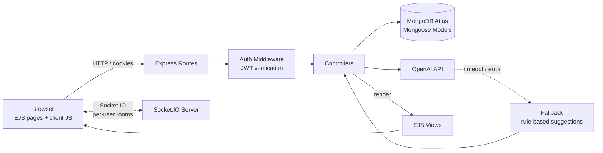

<div align="center">

#  SkillLoop

**A peer-to-peer skill exchange marketplace for students**

Post what you need help with, offer what you can teach, and get matched with the right peer.

**[Live Demo](https://skillloop-chi.vercel.app/)** 

*SIT725 Applied Software Engineering · Deakin University · Team Skill Loop*

</div>

---

## 📑 Table of Contents

- [About the Project](#-about-the-project)
- [Features](#-features)
- [Tech Stack](#-tech-stack)
- [Architecture](#-architecture)
- [Project Structure](#-project-structure)
- [Getting Started](#-getting-started)
- [Environment Variables](#-environment-variables)
- [Available Scripts](#-available-scripts)
- [Testing](#-testing)
- [API Reference](#-api-reference)
- [Deployment](#-deployment)
- [Sprint Summary](#-sprint-summary)
- [Contributing](#-contributing)
- [Team](#-team)
- [License](#-license)

---

##  About the Project

Students often need help with a specific topic, like a tricky assignment concept, a programming language or exam prep, while other students already know it well and are happy to help. SkillLoop connects them.

Users create **posts** saying they either **need help** with a topic or **can tutor** others in it. Other students browse and search posts, open a **post-scoped conversation** with the author, and get **AI-matched suggestions** on their dashboard so relevant posts find them automatically.

Conversations are tied to a specific post rather than open direct messaging, which keeps discussions focused and limits who can contact whom.

---

## Features

| Area | Feature | Use Case |
|---|---|---|
| **Authentication** | Sign up / sign in with bcrypt-hashed passwords and JWT sessions in `httpOnly` cookies | UC1, UC3 |
| **Route protection** | JWT verification middleware rejects missing, invalid, expired and forged tokens | UC3 |
| **Post management** | Create, edit, delete and resolve posts (topic, location, languages, notes), owner-only edits, server-side validation and duplicate prevention | UC5 |
| **Browse & search** | Browse all open posts, search and filter by topic, location and language, with pagination | UC6 |
| **Post details** | Full post view with author profile and threaded comments | UC7 |
| **Messaging** | Post-scoped conversations persisted in MongoDB, with polling fallback | UC8, UC9 |
| **Real-time updates** | Socket.IO server with JWT-authenticated per-user rooms for targeted new-message events | UC10 |
| **Profile** | View and edit profile, account settings and password update | UC11 |
| **Account deletion** | Soft delete that anonymises the user's posts instead of hard-deleting them | UC11 |
| **AI matching** | "Suggested for You" dashboard section powered by `/api/match`, with automatic fallback so suggestions still load if the AI service fails or times out | UC12 |
| **Moderation** | Report a post or user, with schema-level integrity checks and duplicate-report prevention | UC13, UC15 |

---

## Tech Stack

| Layer | Technology |
|---|---|
| **Runtime** | Node.js |
| **Server** | Express 4 |
| **Views** | EJS (server-side rendering) |
| **Database** | MongoDB Atlas + Mongoose 7 |
| **Auth** | JSON Web Tokens (`jsonwebtoken`), bcrypt, `cookie-parser`, `express-session` |
| **Real-time** | Socket.IO (local) with polling fallback (serverless) |
| **Testing** | Jest + Supertest |
| **Code quality** | ESLint 9 + Prettier 3 |
| **Deployment** | Vercel (staging + production) |
| **Project management** | Trello + GitHub feature-branch workflow |

---

## 🏗 Architecture

SkillLoop follows an **MVC-style architecture** with separation of concerns: routes map HTTP requests, controllers hold request logic, Mongoose models own data rules, middleware handles cross-cutting concerns like authentication, and EJS views render the UI.



**Key design decisions**

- **App factory (`createApp()`)**: the same Express app runs locally (`server.js`), as a Vercel serverless function (`api/index.js`) and inside Jest tests without opening a port.
- **Layered validation**: input is checked in controllers, enforced again in Mongoose schemas, and backed by MongoDB indexes (e.g. partial unique indexes on reports), so invalid data can't slip through any single layer.
- **Resilient AI matching**: the dashboard never depends on the AI service being available. If the OpenAI call fails or times out, `/api/match` falls back to rule-based suggestions.
- **Real-time with a fallback**: Socket.IO delivers targeted updates locally, while polling keeps messaging working on Vercel, where serverless functions can't hold WebSocket connections. Messages are always persisted in MongoDB, so nothing is lost on refresh or disconnect.

---

## Project Structure

```text
skillloop/
├── api/
│   └── index.js              # Vercel serverless entry point
├── src/
│   ├── app.js                # Express app factory (createApp)
│   ├── socket.js             # Socket.IO server, JWT-authenticated per-user rooms
│   ├── controllers/          # Request logic (e.g. authController.js)
│   ├── middleware/           # Auth middleware (verifyAuth, isLoggedIn)
│   ├── models/               # Mongoose schemas: User, Post, Comment, Message, Conversation, Report
│   └── routes/               # Route definitions: auth, posts, messages, profile, match, users
├── views/                    # EJS templates (dashboard, posts, messaging, profile, auth)
├── public/
│   ├── css/                  # Page stylesheets
│   └── js/                   # Client-side scripts (auth, messaging polling, etc.)
├── tests/                    # Jest + Supertest test suites
├── docs/                     # Project documentation
├── .github/
│   └── PULL_REQUEST_TEMPLATE.md
├── server.js                 # Local development server (HTTP + Socket.IO)
├── server-vercel-setup.js    # Vercel configuration helper
├── .env.example              # Environment variable template
├── package.json
└── README.md
```

---

## Getting Started

### Prerequisites

- [Node.js](https://nodejs.org/) 18 or later
- A [MongoDB Atlas](https://www.mongodb.com/atlas) cluster (or local MongoDB)
- An OpenAI API key (optional, as AI matching falls back without one)

### Installation

Commands below are for **Windows PowerShell**; they work the same in macOS/Linux terminals.

```powershell
# 1. Clone the repository
git clone https://github.com/SKILLLOOPAPP/skillloop.git
cd skillloop

# 2. Install dependencies
npm install

# 3. Create your environment file
Copy-Item .env.example .env
# (macOS/Linux: cp .env.example .env)

# 4. Fill in your values in .env (see Environment Variables below)

# 5. Start the development server
npm run dev
```

Open **http://localhost:3000**. The terminal should show:

```text
✓ MongoDB connected
✓ SkillLoop running on http://localhost:3000
✓ Socket.IO ready
```

---

## Environment Variables

Copy `.env.example` to `.env` and set:

| Variable | Required | Description |
|---|---|---|
| `MONGODB_URI` | ✅ | MongoDB Atlas connection string |
| `JWT_SECRET` | ✅ | Secret used to sign and verify JWTs |
| `SESSION_SECRET` | ✅ | Secret for `express-session` |
| `OPENAI_API_KEY` | ⬜ | Enables AI matching (falls back to rule-based suggestions if missing) |
| `NODE_ENV` | ⬜ | `development` or `production` (enables `secure` cookies) |
| `PORT` | ⬜ | Server port (default `3000`) |
| `HOST` | ⬜ | Server host (default `localhost`) |
| `FRONTEND_URL` | ⬜ | Allowed CORS origin |
| `SOCKET_IO_CORS` | ⬜ | Allowed Socket.IO origin |
| `EMAIL_SERVICE`, `EMAIL_USER`, `EMAIL_PASSWORD` | ⬜ | Optional email configuration |

> Never commit `.env`. It is listed in `.gitignore`.

---

## Available Scripts

| Command | Description |
|---|---|
| `npm start` | Run the server with Node |
| `npm run dev` | Run with nodemon (auto-restart on changes) |
| `npm test` | Run all Jest test suites |
| `npm run test:coverage` | Run tests with a coverage report |
| `npm run lint` | Check code with ESLint |
| `npm run lint:fix` | Auto-fix ESLint issues |
| `npm run format` | Format code with Prettier |
| `npm run format:check` | Check formatting without changing files |

---

## Testing

Tests use **Jest** and **Supertest**, sending real HTTP requests into the Express app through `createApp()`. They run against a separate `skillloop-test` database, so real data is never touched, and each test clears its data for isolation.

```powershell
# Run everything
npm test

# Run a single suite
npx jest tests/auth.test.js

# Coverage report
npm run test:coverage
```

| Suite | Covers |
|---|---|
| `auth.test.js` | Sign up / sign in validation, duplicate accounts, user-enumeration-safe errors, protected routes, invalid / expired / forged JWT rejection |
| `posts.test.js` | Post CRUD and ownership rules |
| `profileApi.test.js` | Profile retrieval and updates |
| `accountDeletion.test.js` | Soft delete and post anonymisation |

---

## API Reference

### Authentication (`/api/auth`)

| Method | Endpoint | Auth | Description |
|---|---|---|---|
| `POST` | `/api/auth/signup` | Public | Create an account, returns JWT |
| `POST` | `/api/auth/signin` | Public | Sign in, returns JWT |
| `POST` | `/api/auth/signout` | 🔒 JWT | Clear the auth cookie |
| `GET` | `/api/auth/me` | 🔒 JWT | Get the current user |
| `PUT` | `/api/auth/update-password` | 🔒 JWT | Change password |

### Matching

| Method | Endpoint | Auth | Description |
|---|---|---|---|
| `GET` | `/api/match` | 🔒 JWT | AI-matched post suggestions for the current user, with fallback |

### Other routes

| Route | Description |
|---|---|
| `/posts` | Create, browse, search, view, edit and delete posts (login required) |
| `/profile` | View and edit profile (login required) |
| `/api/users/:id` | Get / update user profile |
| `/messages` | Post-scoped conversations |

**Response codes**: `200/201` success · `400` invalid input · `401` not authenticated · `403` account inactive / not permitted · `404` not found · `500` server error

---

## Deployment

SkillLoop deploys to **Vercel** with separate **staging** and **production** environments.

1. Import the repository into Vercel.
2. Add the environment variables above in **Project Settings → Environment Variables** for each environment.
3. Push to a branch for a preview deployment; merges to `main` deploy to production.

`api/index.js` wraps the app as a serverless function. Because serverless functions can't hold WebSocket connections, messaging on Vercel uses polling, while local development uses Socket.IO.

---


## Contributing

We use a **feature-branch workflow**: one branch and one pull request per feature.

For team-wide naming conventions, folder structure, commit message format, code quality rules, testing expectations, and pull request standards, see the [SkillLoop Coding Standards](docs/CODING_STANDARDS.md).

```powershell
git checkout main
git pull
git checkout -b feat/your-feature-name
# make changes, then:
npm test
npm run lint
git add .
git commit -m "feat: short description of the change"
git push -u origin feat/your-feature-name
```

Then open a pull request using the PR template (summary, linked Trello card, test checklist, reviewer notes).

**Branch prefixes:** `feat/` new features · `fix/` bug fixes · `test/` tests · `docs/` documentation

---

## Team

SkillLoop was developed by Team Skill Loop for SIT725 Applied Software Engineering at Deakin University.
- Aaron Chewlun
- Akashdeep Singh
- Arjun Vennu
- Manikkuwadu Kasun Wimalasuriya
- Md Isa Sayek Huda
- Pushpinder Singh

---

</div>
